# Путь синхранизации состояния FRR

Варианты реплизации

| №   | Название                         | Описание                                                                                                   | Решение |
| --- | -------------------------------- | ---------------------------------------------------------------------------------------------------------- | ------- |
| 1   | Постоянные запросы vtysh         | каждую секунуд запрашивать congif через vtysh                                                              | ❌       |
| 2   | Постоянные запросы  gRPC         | каждую секунуд запрашивать congif через vtysh                                                              | ❌       |
| 3   | Наблюдение наших запросов        | перехватывать запросы нашего ПО и инициаировать запросы при каждом таком перехвате                         | ❌       |
| 4   | Редкие запросы  + мониторинг     | Переодические запросы vtysh с паралеьными наблбдениями логов и фиксации не актульного состяния congif      | ✅       |
| 5   | Редкие запросы  + авто-обнвление | Переодические запросы vtysh с паралеьными наблбдениями логов и обновлении при фиксировании изменеия config | ❌       |

## Плюсы/Минусы всех реализаций

### № 1. Постоянные запросы vtysh

Идея просто, каждую секунду запускать vtysh show running-config
- Плюсы
  - Вероятнее всего иметь самые актульные config
- Минусы
  - Да же если мы часто обновляем config все же имеем интервал в секунду без данных
  - Cильная нагрузка на систему
  - Реализация смотриться устарешей

### № 2. Постоянные запросы  gRPC

- Плюсы
  - Имеем те же плюсы что и `Постоянные запросы vtysh` но так же имеем более лучший подход через gRPC
- Минусы
  - Те же минусы что и `Постоянные запросы vtysh`
  - Нельзя реализовывать данную идею потому что mgmtd еще не покрыл bgdp а gRPC это часть Northbound API

### № 3. Наблюдение наших запросов

- Плюсы
  - Можем моментально понимать что config изменились и модем тут же вызвать обновление config
- Минусы
  - Нельзя реализовывать данную идеяю потому что сетевые инженеры могут внести изменения в frr минуя наше ПО

### № 4. Редкие запросы  + мониторинг

- Плюсы
  - Нагрузка практически нулевая
  - Пользовтели нашего ПО всегда будут иметь актульную информацию об сетации в FRR
- Минусы
  - Хоть мы и будем информировать клиента о том config изкняились с момента последнего интервального запроса config но все же мы не будем иметь их а толко информацию о том что они вертяно изменидись 
  - все равно мы делаем запрос через vtysh так как это едиственная возмодность иметь актулные config

### № 5. Редкие запросы  + авто-обнвление 

- Плюсы
  - Пользовтели нашего ПО всегда будут иметь актульный config
- Минусы
  - Очень ужасный варинт учитывая нашу сетацияю потому что будет спам запроса vtysh. Да же если мы будем реализоваыть подход котлна при перезвате изменнеий мы сужаем таймер на секунду то есть будет чаще делать запрос в тот момент когда идут измения то все равно это нагрузка

## Подробный разбор выбранной реализции

Компоненты которые мы будем использовать

- Каналы
  - КАНАЛ_ИЗМЕНИТЬ_КОНФИГ: передать/получить сигнал о то что требуеться синхранизировать config с frr
  - КАНАД_ФЛАГ_ИЗМЕНЕНИЕ: передать/получить сигнал о том что в FRR произошло какрое то воздействие которое возможно повлияло на `running-config`
- Методы
  - МЕТОД_ВЗЯТЬ_КОНФИГ: получние результата запроса `vtysh show running-config`
  - МЕТОД_ОБНОВИТЬ_БАЗУ_КОНФИГ: обновляем базу с config

Мы будем иметь фоновые процессык которые взимоствязанные

1) Наблюдает за КАНАЛ_ИЗМЕНИТЬ_КОНФИГ  для того что бы вызвать МЕТОД_ВЗЯТЬ_КОНФИГ и полученные данные передать в МЕТОД_ОБНОВИТЬ_БАЗУ_КОНФИГ
2) Наблюдает ха КАНАД_ФЛАГ_ИЗМЕНЕНИЕ что бы пометить в базе что данные пока не актулны и вывать МЕТОД_ОБНОВИТЬ_БАЗУ_КОНФИГ
3) Таймер установленные через настроки (примерно) и через инетрвал кладет флаг в КАНАЛ_ИЗМЕНИТЬ_КОНФИГ
4) Так как мы не имеем возможность мониторить изменнеия единым подходри то их у нас несолкко и они могут маштабировать. все они при получении лога о том что произошли изменеия будут коасть флаг в канал КАНАД_ФЛАГ_ИЗМЕНЕНИЕ если он пуст 
   1) Следит за frr.conf и перехватывает log commands. это необходимо вотому что это едитсвенный способ перезватить операции сетивым индинером минуя наше ПО а так же измения bgdp.
   2) Можно реализовать похожий на первый варинта. Вызваем vtysh monitor terminal   и перехватывает log commands. это необходимо вотому что это едитсвенный способ перезватить операции сетивым индинером минуя наше ПО а так же измения bgdp.
   3) Коннект с mgmtd_fe.sock и перехват уведомлений об изменения. Очень тезнически идельный подход но он не достаточен потмоу что поркываает толкьо то что покрывает mgmtd

```mermaid
flowchart LR

    %% =====================================================

    %% СТИЛИ

    %% =====================================================

    classDef timer fill:#0891b2,color:#fff,stroke:#164e63

    classDef detect fill:#7c3aed,color:#fff,stroke:#4c1d95

    classDef channel fill:#ea580c,color:#fff,stroke:#7c2d12

    classDef worker fill:#059669,color:#fff,stroke:#064e3b

    classDef storage fill:#dc2626,color:#fff,stroke:#7f1d1d

    classDef user fill:#475569,color:#fff,stroke:#1e293b

    %% =====================================================

    %% СИНХРОНИЗАЦИЯ КОНФИГА

    %% =====================================================

    subgraph CONFIGSYNC["🔄 Синхронизация running-config"]

        TIMER["⏱ Таймер синхронизации"]

        SYNCCHANNEL["📨 Канал синхронизации"]

        CONFIGWORKER["⚙️ Обновитель конфигурации"]

        FETCH["📥 vtysh show running-config"]

    end

    class TIMER timer

    class SYNCCHANNEL channel

    class CONFIGWORKER,FETCH worker

    %% =====================================================

    %% DETECTORS

    %% =====================================================

    subgraph DETECTORS["👀 Перехватчики изменений"]

        LOGS["📜 log commands"]

        TERMINAL["🖥 vtysh monitor terminal"]

        MGMTD["⚡ mgmtd notifications"]

    end

    class LOGS,TERMINAL,MGMTD detect

    %% =====================================================

    %% DIRTY FLOW

    %% =====================================================

    subgraph DIRTYSYNC["🚨 Обработка dirty-state"]

        DIRTYCHANNEL["📨 Канал dirty-событий"]

        DIRTWORKER["⚙️ Обновитель состояния"]

    end

    class DIRTYCHANNEL channel

    class DIRTWORKER worker

    %% =====================================================

    %% БАЗА

    %% =====================================================

    subgraph DB["🗄 База состояния FRR"]

        CONFIGDB["running-config"]

        FLAGDB["dirty-state"]

    end

    class CONFIGDB,FLAGDB storage

    %% =====================================================

    %% КЛИЕНТ

    %% =====================================================

    USER["🧑 UI / API / Пользователь"]

    class USER user

    %% =====================================================

    %% FLOW CONFIG

    %% =====================================================

    TIMER --> SYNCCHANNEL

    SYNCCHANNEL --> CONFIGWORKER

    CONFIGWORKER --> FETCH

    FETCH --> CONFIGDB

    %% =====================================================

    %% FLOW DIRTY

    %% =====================================================

    LOGS --> DIRTYCHANNEL

    TERMINAL --> DIRTYCHANNEL

    MGMTD --> DIRTYCHANNEL

    DIRTYCHANNEL --> DIRTWORKER

    DIRTWORKER --> FLAGDB

    %% =====================================================

    %% CLIENT FLOW

    %% =====================================================

    CONFIGDB --> USER

    FLAGDB --> USER
```

