# Подход к синхронизации состояния FRR

## Контекст

Нужно хранить в нашем ПО состояние `running-config` из FRR и показывать пользователю, насколько этим данным можно доверять. Важно учитывать, что конфигурацию могут менять не только через наше ПО, но и напрямую в FRR, например действиями сетевого инженера.

## Рассмотренные варианты

| №   | Название                                             | Описание                                                                                                      | Решение |
| --- | ---------------------------------------------------- | ------------------------------------------------------------------------------------------------------------- | ------- |
| 1   | Частый polling через `vtysh`                         | Каждую секунду запрашивать конфигурацию через `vtysh show running-config`.                                    | ❌       |
| 2   | Частый polling через gRPC/Northbound API             | Каждую секунду запрашивать конфигурацию через gRPC/Northbound API.                                            | ❌       |
| 3   | Отслеживание изменений только из нашего ПО           | Перехватывать запросы нашего ПО и запускать синхронизацию после каждого такого запроса.                       | ❌       |
| 4   | Периодическая синхронизация + детекция изменений     | Периодически запрашивать конфигурацию через `vtysh` и параллельно фиксировать признаки внешних изменений.     | ✅       |
| 5   | Периодическая синхронизация + внеочередное обновление | Периодически запрашивать конфигурацию через `vtysh` и запускать обновление при обнаружении изменений.         | ❌       |

## Сравнение вариантов

### № 1. Частый polling через `vtysh`

Идея подхода: каждую секунду выполнять `vtysh show running-config`.

Плюсы:

- Система с высокой вероятностью будет хранить близкую к актуальной конфигурацию.
- Реализация простая для понимания и не требует дополнительных механизмов детекции изменений.
- Подход не зависит от степени готовности новых API FRR.

Минусы:

- Даже при частом обновлении остается интервал, в котором данные могут быть неактуальны.
- Подход создает заметную постоянную нагрузку на систему.
- Реализация выглядит грубой и плохо масштабируется.
- Частые вызовы `vtysh` могут создавать лишний шум в диагностике и усложнять анализ производительности.

### № 2. Частый polling через gRPC/Northbound API

Идея подхода: регулярно получать конфигурацию через gRPC/Northbound API вместо прямого вызова `vtysh`.

Плюсы:

- Сохраняет основное преимущество частого polling через `vtysh`: данные часто обновляются.
- Технически выглядит современнее, чем постоянные shell-вызовы `vtysh`.
- Лучше подходит для будущего, если покрытие `mgmtd` станет полным для нужных демонов FRR.
- Потенциально упрощает типизацию, валидацию и обработку структурированных данных.

Минусы:

- Сохраняет минусы частого polling: нагрузка и наличие интервала возможной неактуальности.
- Подход нельзя использовать как основной, потому что `mgmtd` пока не покрывает `bgpd`, а gRPC является частью Northbound API и не дает полной картины по нужной конфигурации.
- Есть риск получить неполное состояние и показать пользователю конфигурацию, которая выглядит актуальной, но не отражает все важные части FRR.

### № 3. Отслеживание изменений только из нашего ПО

Идея подхода: считать источником изменений только запросы, которые проходят через наше ПО.

Плюсы:

- Можно быстро понять, что наше ПО инициировало изменение конфигурации.
- Можно сразу запустить обновление сохраненного состояния.
- Нагрузка на систему минимальна, потому что нет постоянного polling.
- Подход хорошо работает для изменений, которые полностью проходят через контролируемый нами API.

Минусы:

- Подход нельзя использовать как основной, потому что сетевые инженеры могут менять FRR напрямую, минуя наше ПО.
- Внешние изменения останутся незамеченными.
- Система может показывать устаревшие данные как актуальные, если изменение было сделано вне нашего ПО.

### № 4. Периодическая синхронизация + детекция изменений

Идея подхода: планово запрашивать `running-config` через `vtysh` с умеренным интервалом, например примерно раз в 15 секунд, а между плановыми обновлениями отслеживать события, которые могут означать изменение конфигурации.

Плюсы:

- Нагрузка на систему остается низкой.
- Пользователи нашего ПО получают последнюю сохраненную конфигурацию FRR.
- Пользователи видят статус актуальности и понимают, можно ли доверять сохраненному состоянию.
- Подход учитывает изменения, выполненные не только через наше ПО, но и напрямую в FRR.
- Подход дает хороший баланс между актуальностью данных и предсказуемой нагрузкой на систему.
- Механизм можно расширять новыми детекторами изменений без изменения основной схемы синхронизации.

Минусы:

- После обнаружения признака изменения мы не получаем новую конфигурацию сразу, а только помечаем сохраненные данные как потенциально устаревшие.
- Для получения актуального `running-config` все равно нужен `vtysh`, потому что сейчас это единственный надежный способ получить полную нужную конфигурацию.
- `dirty-state` означает вероятность изменения, а не гарантирует, что конфигурация действительно изменилась.

### № 5. Периодическая синхронизация + внеочередное обновление

Идея подхода: периодически запрашивать `running-config` через `vtysh`, а при обнаружении изменений запускать внеочередное обновление.

Плюсы:

- Пользователи нашего ПО чаще получают актуальную конфигурацию.
- `dirty-state` может закрываться быстрее, потому что после обнаружения изменения система сразу пытается получить новый `running-config`.
- Пользователю реже приходится видеть состояние "возможно устарело".

Минусы:

- Для нашей ситуации это рискованный вариант: при серии изменений может начаться большое количество вызовов `vtysh`.
- Даже если при обнаружении изменений временно уменьшать интервал синхронизации, во время активных изменений нагрузка на систему все равно вырастет.
- Для стабильной работы потребуются дополнительные механизмы: debounce, throttle, очередь или объединение событий.
- При массовых изменениях возможны каскадные обновления, которые усложнят контроль нагрузки и диагностику.

## Решение

Выбран вариант № 4: периодическая синхронизация + детекция изменений.

Мы не пытаемся получать новую конфигурацию после каждого возможного изменения. Вместо этого система хранит последнюю успешно полученную конфигурацию и отдельно фиксирует признак `dirty-state`, если после последней синхронизации были события, которые могли изменить `running-config`.

Плановая синхронизация не является редкой в смысле "раз в день" или "раз в несколько часов". Ожидаемый интервал обновления - примерно 15 секунд. Конкретное значение должно задаваться настройками приложения, чтобы его можно было менять без изменения логики синхронизации.

Такой подход дает пользователю две важные вещи:

- последнюю известную конфигурацию FRR;
- понятный статус, актуальна она или могла устареть.

## Термины

| Термин | Значение |
| ------ | -------- |
| `running-config` | Конфигурация FRR, полученная через `vtysh show running-config` во время последней успешной синхронизации. |
| `dirty-state` | Признак того, что после последней успешной синхронизации были события, которые могли изменить `running-config`. |
| Детектор изменений | Фоновый процесс, который отслеживает один из источников событий и сообщает о возможном изменении конфигурации. |

## Компоненты решения

### Каналы

- `CONFIG_SYNC_CHANNEL` - канал, через который передается сигнал о необходимости синхронизировать конфигурацию FRR.
- `CONFIG_DIRTY_CHANNEL` - канал, через который передается сигнал о событии в FRR, которое могло повлиять на `running-config`.

### Методы

- `fetchRunningConfig` - получает результат выполнения `vtysh show running-config`.
- `updateConfigState` - обновляет сохраненное состояние конфигурации и связанные с ним метаданные.

## Фоновые процессы

1. Процесс синхронизации слушает `CONFIG_SYNC_CHANNEL`, вызывает `fetchRunningConfig` и передает полученные данные в `updateConfigState`.
2. Процесс обработки dirty-событий слушает `CONFIG_DIRTY_CHANNEL` и через `updateConfigState` помечает в базе, что сохраненные данные могут быть неактуальны.
3. Таймер синхронизации, настроенный через параметры приложения, с заданным интервалом отправляет сигнал в `CONFIG_SYNC_CHANNEL`. Ориентировочное значение интервала - примерно 15 секунд.
4. Детекторы изменений отслеживают разные источники событий. Если детектор видит признак изменения конфигурации, он отправляет сигнал в `CONFIG_DIRTY_CHANNEL`, если такой сигнал еще не ожидает обработки.

## Источники dirty-событий

Так как сейчас нет единого надежного механизма, который покрывает все возможные изменения FRR, используется несколько источников. Их список можно расширять.

1. Наблюдение за `frr.conf` и перехват `log commands`. Это нужно, чтобы обнаруживать операции, выполненные сетевым инженером напрямую, минуя наше ПО, а также изменения в `bgpd`.
2. Запуск `vtysh monitor terminal` и перехват `log commands`. Это альтернативный или дополнительный способ фиксировать операции, выполненные напрямую в FRR, включая изменения в `bgpd`.
3. Подключение к `mgmtd_fe.sock` и перехват уведомлений об изменениях. Технически это хороший подход, но сейчас он недостаточен как единственный источник, потому что покрывает только те части FRR, которые покрывает `mgmtd`.

```mermaid
flowchart LR

    %% =====================================================

    %% СТИЛИ

    %% =====================================================

    classDef timer fill:#0891b2,color:#fff,stroke:#164e63

    classDef detect fill:#7c3aed,color:#fff,stroke:#4c1d95

    classDef channel fill:#ea580c,color:#fff,stroke:#7c2d12

    classDef worker fill:#059669,color:#fff,stroke:#064e3b

    classDef storage fill:#dc2626,color:#fff,stroke:#7f1d1d

    classDef user fill:#475569,color:#fff,stroke:#1e293b

    %% =====================================================

    %% СИНХРОНИЗАЦИЯ КОНФИГА

    %% =====================================================

    subgraph CONFIGSYNC["🔄 Синхронизация running-config"]

        TIMER["⏱ Таймер синхронизации"]

        SYNCCHANNEL["📨 Канал синхронизации"]

        CONFIGWORKER["⚙️ Обновитель конфигурации"]

        FETCH["📥 vtysh show running-config"]

    end

    class TIMER timer

    class SYNCCHANNEL channel

    class CONFIGWORKER,FETCH worker

    %% =====================================================

    %% DETECTORS

    %% =====================================================

    subgraph DETECTORS["👀 Перехватчики изменений"]

        LOGS["📜 log commands"]

        TERMINAL["🖥 vtysh monitor terminal"]

        MGMTD["⚡ mgmtd notifications"]

    end

    class LOGS,TERMINAL,MGMTD detect

    %% =====================================================

    %% DIRTY FLOW

    %% =====================================================

    subgraph DIRTYSYNC["🚨 Обработка dirty-state"]

        DIRTYCHANNEL["📨 Канал dirty-событий"]

        DIRTWORKER["⚙️ Обновитель состояния"]

    end

    class DIRTYCHANNEL channel

    class DIRTWORKER worker

    %% =====================================================

    %% БАЗА

    %% =====================================================

    subgraph DB["🗄 База состояния FRR"]

        CONFIGDB["running-config"]

        FLAGDB["dirty-state"]

    end

    class CONFIGDB,FLAGDB storage

    %% =====================================================

    %% КЛИЕНТ

    %% =====================================================

    USER["🧑 UI / API / Пользователь"]

    class USER user

    %% =====================================================

    %% FLOW CONFIG

    %% =====================================================

    TIMER --> SYNCCHANNEL

    SYNCCHANNEL --> CONFIGWORKER

    CONFIGWORKER --> FETCH

    FETCH --> CONFIGDB

    %% =====================================================

    %% FLOW DIRTY

    %% =====================================================

    LOGS --> DIRTYCHANNEL

    TERMINAL --> DIRTYCHANNEL

    MGMTD --> DIRTYCHANNEL

    DIRTYCHANNEL --> DIRTWORKER

    DIRTWORKER --> FLAGDB

    %% =====================================================

    %% CLIENT FLOW

    %% =====================================================

    CONFIGDB --> USER

    FLAGDB --> USER
```

## Данные, доступные клиенту

В итоге клиент будет получать следующие данные:

| Данные | Описание |
| ------ | -------- |
| Последняя сохраненная конфигурация FRR | Значение `running-config`, полученное при последней успешной синхронизации. |
| Статус актуальности | Признак того, является конфигурация актуальной или могла устареть. |
| Время последнего обновления | Момент последней успешной синхронизации с FRR. |
| Время возможного устаревания | Момент, когда был зафиксирован сигнал о событии, которое могло изменить `running-config`. |
| Время следующего обновления | Плановое время следующей синхронизации с FRR. |
